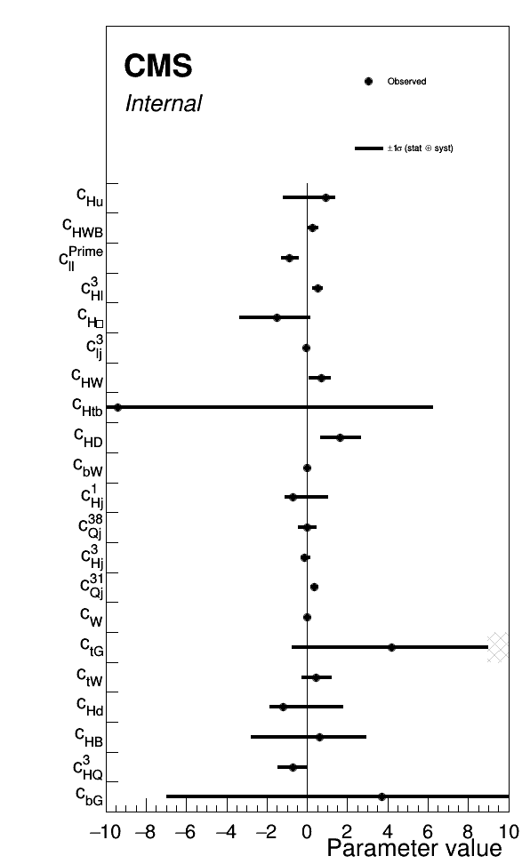

# EFT fitting exercise

This project currently performs an EFT combination of three analyses:
 - HIG-19-005: Hγγ STXS
 - TOP-17-023: Single-top (t-channel)
 - SMP-20-005: Wγ production

The combination is based on the publicly available hepData records. The EFT parameterisation is generated with EFT2Obs, using SMEFTsim 3.0 with the `topU3l` flavour model.

Useful links:
 - [Input analyses spreadsheet](https://docs.google.com/spreadsheets/d/1lynhfS0xjqNpHQ-LBJ0xQK2xN5P3J8LWfHFUxutFZfs/edit#gid=0)
 - [Conventions twiki](https://twiki.cern.ch/twiki/bin/view/LHCPhysics/LHCEFTExpCombinationConventions)
 - [Area 4 talk (Nov 21 Meeting)](https://indico.cern.ch/event/1076709/contributions/4596408/subcontributions/357249/attachments/2350785/4009533/hmilder_lhceftcombi_v3.pdf)


## Setup

Clone this repository somewhere:

```sh
git clone https://github.com/ajgilbert/eft-exercise-cms.git
```

The EFT2Obs repository is included as a submodule. It is not necessary to initialise this to just run the fits, but if you would also like to also test generating the EFT parameterisations, you should run `git submodule update --init`, then follow the EFT2Obs setup instructions [here](https://github.com/ajgilbert/EFT2Obs#initial-setup).

To get a standard environment and for a few plotting scripts at the end, we will set up a CMSSW area:
```sh
cd eft-exercise
export SCRAM_ARCH=slc7_amd64_gcc700
cmsrel CMSSW_10_2_13
cd CMSSW_10_2_13/src
cmsenv
git clone https://github.com/cms-analysis/HiggsAnalysis-CombinedLimit.git HiggsAnalysis/CombinedLimit
cd HiggsAnalysis/CombinedLimit
cd ../../
git clone https://github.com/cms-analysis/CombineHarvester.git CombineHarvester
scram b -j4
cd ../../
```

**NB: this software setup step is not required to run the fit, only for plotting the results. However a recent ROOT installation should be available.**

## Workflow

Currently, the full workflow of importing the analysis fit results and covariances matrices, constructing the likelihood model, and performing the likelihood scans is handled by one script: `testFit.py`. The script has comments throughout that explain each step. It reads the hepData input from the `hepdata_inputs` directory, and the EFT2Obs json output from the `eft2obs_inputs` directory.

```sh
python testFit.py
```

Currently the script will perform a fit and likelihood scan for each EFT coefficient in turn. A simultaneous fit of multiple parameters will generally fail as there are too many degeneracies.
This will produce a set of output root files, `nll_scan_[X].root`, one for each parameter of interest.

Now we can make the NLL scan plots for each one. This script will also interpolate the 1 sigma intervals and store them in an output JSON file.

```sh
for POI in chdd chj3 chl3 chwb clj3 cll1 cw chg chb chbox chd chj1 chu chw cbgre cbwre chq3 chtbre cqj31 cqj38 ctgre ctwre ; do python ./plot1DScan.py -m scan_${POI}.root --POI ${POI} --translate translate_root_SMEFTsim3.json --model eft --output nll_scan_${POI} --json eft_scans.json --no-input-label --chop 10; done
```

From this JSON file we can make a summary plot of the fit results:

```sh
python ./summaryPlot.py --input 'eft_scans.json:eft/*' --output eft_summary --vlines 0:LineWidth=1 --show-bars Error --legend Error --x-range=-10,10 --translate translate_root_SMEFTsim3.json --subline '' --frame-frac 0.80 --height 1000
```



## EFT2Obs instructions

Set up the SMEFTsim model:
```sh
cd EFT2Obs
source env.sh
./scripts/setup_model_SMEFTsim3.sh
```

The cards for each process are in:
- Wγ: `cards/WG-SMEFTsim3`
- Hγγ (qqH only): `cards/qqH-SMEFTsim3`
- single-top: `cards/st_tch_4f-SMEFTsim3`

Set up each process and create the gridpack following the standard workflow:

```sh
./scripts/setup_process.sh [X]-SMEFTsim3


python scripts/make_config.py -p WG-SMEFTsim3 -o config_WG-SMEFTsim3.json --pars SMEFT:5,28,104,9,109,107,2 --def-val 0.01 --def-sm 0.0 --def-gen 0.0

python scripts/make_config.py -p qqH-SMEFTsim3 -o config_qqH-SMEFTsim3.json --pars SMEFT:8,4,32,5,26,28,104,30,7,9,107 --def-val 0.01 --def-sm 0.0 --def-gen 0.0

python scripts/make_config.py -p st_tch_4f-SMEFTsim3 -o config_st_tch_4f-SMEFTsim3.json --pars SMEFT:21,23,28,104,29,35,107,42,43,15,17 --def-val 0.01 --def-sm 0.0 --def-gen 0.0


./scripts/make_gridpack.sh [X]-SMEFTsim3 0 4
```


Generate events in a quick local run:
```sh
python scripts/run_gridpack.py --seed 1 -e 10000 -p CMS_2021_PAS_SMP_20_005 --gridpack gridpack_WG-SMEFTsim3.tar.gz -o localtest-WG-SMEFTsim3

python scripts/run_gridpack.py --seed 1 -e 10000 -p CMS_2019_I1744604  --gridpack gridpack_st_tch_4f-SMEFTsim3.tar.gz -o localtest-st_tch_4f-SMEFTsim3

HIGGSPRODMODE=VBF python scripts/run_gridpack.py --seed 1 -e 10000 -p HiggsTemplateCrossSections  --gridpack gridpack_qqH-SMEFTsim3.tar.gz -o localtest-qqH-SMEFTsim3
```

Or a set of condor jobs to get better stats:
```sh
python scripts/launch_jobs.py --gridpack gridpack_WG-SMEFTsim3.tar.gz -j 50 -s 1 -e 20000 -p CMS_2021_PAS_SMP_20_005 -o test-WG-SMEFTsim3 --sub-opts '+MaxRuntime = 14400\nrequirements = (OpSysAndVer =?= "CentOS7")' --task-name test-WG-SMEFTsim3 --dir jobs --job-mode condor

python scripts/launch_jobs.py --gridpack gridpack_st_tch_4f-SMEFTsim3.tar.gz -j 50 -s 1 -e 20000 -p CMS_2019_I1744604 -o test-st_tch_4f-SMEFTsim3 --sub-opts '+MaxRuntime = 14400\nrequirements = (OpSysAndVer =?= "CentOS7")' --task-name test-st_tch_4f-SMEFTsim3 --dir jobs --job-mode condor

python scripts/launch_jobs.py --gridpack gridpack_qqH-SMEFTsim3.tar.gz -j 50 -s 1 -e 20000 -p HiggsTemplateCrossSections -o test-qqH-SMEFTsim3 --sub-opts '+MaxRuntime = 14400\nrequirements = (OpSysAndVer =?= "CentOS7")' --task-name test-qqH-SMEFTsim3 --dir jobs --job-mode condor --env "HIGGSPRODMODE=VBF"
```

Merge the output yoda files using `yodamerge -o RivetTotal.yoda Rivet_* --no-veto-empty`.

Produce the scaling term json files:
```sh
python scripts/get_scaling.py -c config_st_tch_4f-SMEFTsim3.json -i test-st_tch_4f-SMEFTsim3/RivetTotal.yoda --hist "/CMS_2019_I1744604/d13-x01-y01" --bin-labels eft_exercise_bin_labels.json


python scripts/get_scaling.py -c config_WG-SMEFTsim3.json -i test-WG-SMEFTsim3/RivetTotal.yoda --hist "/CMS_2021_PAS_SMP_20_005/d54-x01-y01" --bin-labels eft_exercise_bin_labels.json
python scripts/get_scaling.py -c config_WG-SMEFTsim3.json -i test-WG-SMEFTsim3/RivetTotal.yoda --hist "/CMS_2021_PAS_SMP_20_005/d55-x01-y01" --bin-labels eft_exercise_bin_labels.json
python scripts/get_scaling.py -c config_WG-SMEFTsim3.json -i test-WG-SMEFTsim3/RivetTotal.yoda --hist "/CMS_2021_PAS_SMP_20_005/d56-x01-y01" --bin-labels eft_exercise_bin_labels.json

python scripts/get_scaling.py -c config_qqH-SMEFTsim3.json -i test-qqH-SMEFTsim3/RivetTotal.yoda --hist "/HiggsTemplateCrossSections/HTXS_stage1_2_pTjet30" --bin-labels eft_exercise_bin_labels.json --rebin 18,19,20,21,22,23,24,25,26,27,28,29
```

Make plots showing the effect of each operator on the observables:

```sh
python scripts/makePlot.py --hist CMS_2019_I1744604_d13-x01-y01.json -c config_st_tch_4f-SMEFTsim3.json --x-title 'top quark p_{T} (GeV)' --show-unc --draw chj3=1.0:4 chl3=1.0:6 cll1=2.5:9 --ratio 0.5,1.5 --translate resources/translate_root_SMEFTsim3.json

python scripts/makePlot.py --hist HiggsTemplateCrossSections_HTXS_stage1_2_pTjet30.json -c config_qqH-SMEFTsim3.json --x-title 'STXS bin' --show-unc --draw chj3=1.0:4 chl3=1.0:6 cll1=2.5:9 --ratio 0.5,1.5 --translate resources/translate_root_SMEFTsim3.json

for P in 54 55 56; do python scripts/makePlot.py --hist CMS_2021_PAS_SMP_20_005_d${P}-x01-y01.json -c config_WG-SMEFTsim3.json --x-title 'Photon p_{T} GeV' --show-unc --draw chj3=1.0:4 chl3=1.0:6 cll1=2.5:9 --ratio 0.5,1.5 --translate resources/translate_root_SMEFTsim3.json; done
```
