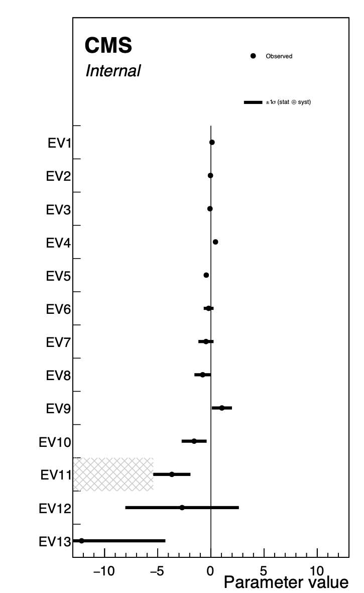

# EFT fitting exercise

This project currently performs an EFT combination of four analyses:
 - HIG-19-005: $H\gamma\gamma$ STXS
 - TOP-17-023: Single-top (t-channel)
 - SMP-20-005: $W\gamma$ production
 - ATLAS-STDM-2017-24: $WW$

The combination is based on the publicly available hepData records. The EFT parameterisation is generated with EFT2Obs, using SMEFTsim 3.0 with the `topU3l` flavour model.

Useful links:
 - [Input analyses spreadsheet](https://docs.google.com/spreadsheets/d/1lynhfS0xjqNpHQ-LBJ0xQK2xN5P3J8LWfHFUxutFZfs/edit#gid=0)
 - [Conventions twiki](https://twiki.cern.ch/twiki/bin/view/LHCPhysics/LHCEFTExpCombinationConventions)
 - [Area 4 talk (Nov 21 Meeting)](https://indico.cern.ch/event/1076709/contributions/4596408/subcontributions/357249/attachments/2350785/4009533/hmilder_lhceftcombi_v3.pdf)


## Setup

Clone this repository somewhere:

```sh
git clone https://github.com/ajgilbert/eft-exercise-cms.git
```

The EFT2Obs repository is included as a submodule. It is not necessary to initialise this to just run the fits, but if you would also like to also test generating the EFT parameterisations, you should run `git submodule update --init`, then follow the EFT2Obs setup instructions [here](https://github.com/ajgilbert/EFT2Obs#initial-setup).

To run the fit, a recent ROOT installation needs to be available. The code has been tested with the environment provided by the following setup:
```sh
cd eft-exercise-cms
export SCRAM_ARCH=slc7_amd64_gcc700
cmsrel CMSSW_10_2_13
cd CMSSW_10_2_13/src
cmsenv
cd ../../
```

**NB: this software setup step is not always required if you already have a recent ROOT installation, but other environments have been found to lead to errors.**


## Workflow

The full workflow of importing the analysis fit results and covariances matrices, constructing the likelihood model, and performing the fits and likelihood scans is handled by three scripts: `pca.py`, `workspace.py`, and `fit.py`. The scripts have comments throughout that explain each step.


### Basis rotation

A simultaneous fit of multiple parameters in the Warsaw basis will generally fail as there are too many degeneracies. We do a basis rotation in order to constrain multiple Wilson coefficients simultaneously. The rotation matrix is obtained by a principal component analysis (PCA), which is handled by the script `pca.py`. The script constructs a block-diagonal combined covariance matrix $V_\text{xs}$, inverts it, and rotates it to the EFT basis $c_j$

$$ V_\text{EFT}^{-1} = P^T V_\text{xs}^{-1} P $$

using the linear parameterisation matrix $P$ with rows running over the measurement bins and columns running over the Wilson coefficients, i.e. the $(i,j)$-element of $P$ is $A_{c_j}^{\text{bin }i}$. In the Gaussian limit, $V_\text{EFT}^{-1}$ is the Fisher information matrix of the (linearised) SMEFT parameterisation. 

By an eigendecomposition of the Fisher information matrix, we obtain a set of orthogonal directions in parameter space, the eigenvectors $\text{EV}_k$. The uncertainty of a measurement in direction of the eigenvector $\text{EV}_k$ is equal to one over the square root of its eigenvalue: $\sigma_k = 1/\sqrt{\lambda_k}$.

The input arguments to `pca.py` are of the form `[label]:[measurement file]:[scaling file, ...]`. The arguments `--rundir` and `--output` are optional, the default directory name is `rundir_{label1,label2,...}`. Example:

```sh
python pca.py \
  --input hgg:measurements/CMS_hgg_STXS.json:scalings/HiggsTemplateCrossSections_HTXS_stage1_2_pTjet30.json \
  wg:measurements/CMS_wgamma.json:scalings/CMS_2021_PAS_SMP_20_005_d54-x01-y01.json,scalings/CMS_2021_PAS_SMP_20_005_d55-x01-y01.json,scalings/CMS_2021_PAS_SMP_20_005_d56-x01-y01.json \
  singlet:measurements/CMS_singlet.json:scalings/CMS_2019_I1744604_d13-x01-y01.json \
  ww:measurements/ATLAS_WW_parsed.yaml:scalings/ATLAS_2019_I1734263_d04-x01-y01.json \
  --rundir examplerun --output rotmatrix.json
```

The Fisher information matrix $V_\text{EFT}^{-1}$, the rotation matrix $(\text{EV}_1 , ... , \text{EV}_N )$, and the eigenvalues $\lambda_k$ are saved in the output JSON file. Use the script `drawMatrix.py` to visualise the two matrices:

```sh
python drawMatrix.py --input examplerun/rotmatrix.json:fishermatrix --xlabels xpars --title 'Fisher information matrix'
python drawMatrix.py --input examplerun/rotmatrix.json:rotationmatrix --xlabels xpars --ylabels ypars --title 'Basis rotation'
```


### Preparing the workspace

The script `workspace.py` creates a ROOT file with two RooWorkspaces, `wsp_lin` and `wsp_quad`, containing a multivariate Gaussian pdf of the input measurements with the linearised and linear+quadratic EFT parameterisation respectively. When the output of `pca.py` is given as an argument to `workspace.py`, the workspaces are created in the rotated basis. When no basis rotation is used, a list of Wilson coefficients can be given with the `--coeffs` argument. Otherwise, the full set of coefficients found in the scaling files is used.

```sh
python workspace.py \
  --input hgg:measurements/CMS_hgg_STXS.json:scalings/HiggsTemplateCrossSections_HTXS_stage1_2_pTjet30.json \
  wg:measurements/CMS_wgamma.json:scalings/CMS_2021_PAS_SMP_20_005_d54-x01-y01.json,scalings/CMS_2021_PAS_SMP_20_005_d55-x01-y01.json,scalings/CMS_2021_PAS_SMP_20_005_d56-x01-y01.json \
  singlet:measurements/CMS_singlet.json:scalings/CMS_2019_I1744604_d13-x01-y01.json \
  ww:measurements/ATLAS_WW_parsed.yaml:scalings/ATLAS_2019_I1734263_d04-x01-y01.json \
  --rundir examplerun --rotation rotmatrix.json --output workspace.root
```


### Fitting

The fit is done with the script `fit.py`:

```sh
python fit.py --rundir examplerun --input workspace.root --output fitresult.json --scan
```

It takes the RooWorkspace with the linearised model (option `--quadratic` or `-q` to use the linear+quadratic model) from the file `workspace.root` in the directory `examplerun`, does a simultaneous fit of all parameters of interest, and saves the best-fit value and uncertainty of each parameter, and the correlation matrix in `fitresult.json`. Parameters with large uncertainty are automatically fixed to zero (uncertainty $>10$ by default, can be changed with the `--max_unc` option). Parameters can be manually fixed to zero using the `--fix` option, e.g. when working in the rotated basis, you could look at the eigenvalues in `rotmatrix.json` and fix all eigenvectors to zero that have $\lambda$ smaller than some threshold with `--fix EV19 EV20 EV21 EV22 EV23 EV24 EV25`.


### Parameter Scans

With the option `--scan`, the script `fit.py` also does a likelihood scan of each parameter. This produces a set of output files `scan_{POI}_lin.root` in the directory `examplerun/scans`. Alternatively the option `--scan_fixed` can be used to do the likelihood scans with all other parameters fixed to zero. In the rotated basis with the linearised model, the POIs are orthogonal, so `--scan` and `--scan_fixed` are expected to give the same result, but when working in the Warsaw basis or using the linear+quadratic model, `--scan_fixed` can be useful.

When working in the Warsaw basis, the simultaneous fit of the parameters of interest will likely fail. With the option `--scan_only`, `fit.py` will skip the simultaneous fit and only do likelihood scans for each parameter in turn (with all other parameters fixed to zero).

Now we can make the NLL scan plots for each POI. The script `plot1DScan.py` will also interpolate the 1 sigma intervals and store them in an output JSON file.

```sh
for POI in EV{1..13} ;
do python ./plot1DScan.py -m examplerun/scans/scan_${POI}_lin.root \
  --POI ${POI} --translate translate_root_SMEFTsim3.json --output examplerun/scans/nll_scan_${POI} \
  --model eft --json examplerun/eft_scans.json --no-input-label ; 
done
```

From this JSON file we can make a summary plot of the fit results:

```sh
python ./summaryPlot.py --input 'examplerun/eft_scans.json:eft/*' \
  --output examplerun/eft_summary --vlines 0:LineWidth=1 --show-bars Error --legend Error \
  --x-range=-13,13 --translate translate_root_SMEFTsim3.json --subline '' --frame-frac 0.80 --height 1000
```



## EFT2Obs instructions

We use EFT2Obs with SMEFTsim3 to generate the EFT parameterisations. The cards for the event generation for each process can be found in the directory `eft2obs_cards`. Instructions can be found [here](eft2obs_cards/README.md)
