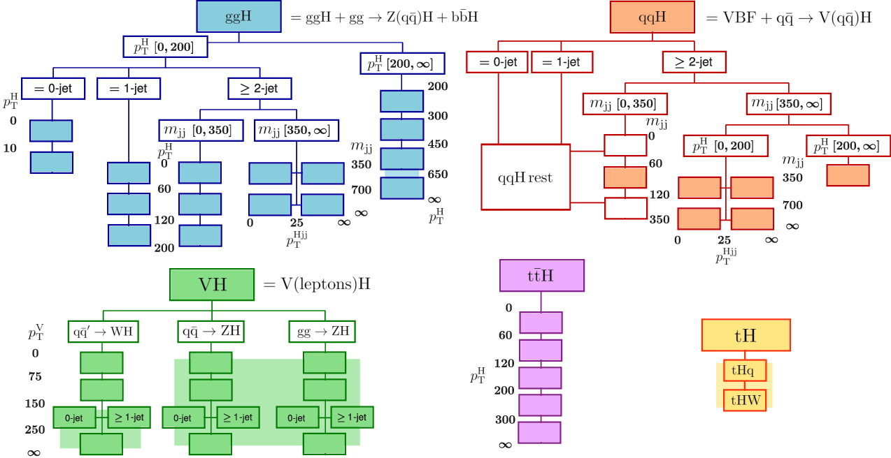

# EFT parameterisations for Higgs STXS

To generate the EFT parameterisations for the STXS bins using the cards provided in this directory, copy each subdirectory to `EFT2Obs/cards` and follow the instructions [here](../README.md). The full setup starting from scratch is described in this README.



## Process definition

For each production mode, `qqH`, `ggH`, `WH`, `ZH`, `ttH`, `tH`, create a subdirectory `{PRODUCTION_MODE}-SMEFTsim3` in `EFT2Obs/cards` and add a `proc_card.dat` specifying the model and defining the process. E.g. for qqH, the `proc_card.dat` looks like this:
```
import model SMEFTsim_topU3l_MwScheme_UFO-massless

generate p p > h j j QCD=0 NP<=1

output qqH-SMEFTsim3 -nojpeg
```
For the other production modes, use the following process definitions:

ggH:
```
generate g g > h SMHLOOP<=1 NP<=1 @0
add process g g > h j SMHLOOP<=1 NP<=1 @1
add process g g > h j j SMHLOOP<=1 NP<=1 @2
```

WH:
```
generate p p > h l+ vl NP<=1 @0
add process p p > h l- vl~ NP<=1 @1
add process p p > h l+ vl j NP<=1 @2
add process p p > h l- vl~ j NP<=1 @3
```

ZH:
```
generate p p > h l+ l- NP<=1 @0
add process p p > h vl vl~ NP<=1 @1
add process p p > h l+ l- j NP<=1 @2
add process p p > h vl vl~ j NP<=1 @3
```

ttH:
```
generate p p > h t t~ QCD<=4 SMHLOOP<=1 NP<=1 @0
add process p p > h t t~ j QCD<=4 SMHLOOP<=1 NP<=1 @1
```

tH:
```
generate p p > h t j NP<=1 @0
add process p p > h t~ j NP<=1 @1
add process p p > h t l- vl~ NP<=1 @2
add process p p > h t~ l+ vl NP<=1 @3
```


## Set up MadSpin for top quark decays

We use `MadSpin` to decay the top quarks. To `cards/ttH-SMEFTsim3` and `cards/tH-SMEFTsim3`, add a `madspin_card.dat` with the following content:
```
set ms_dir ./madspingrid
set Nevents_for_max_weigth 250
set max_weight_ps_point 400
set max_running_process 1

decay t > w+ b, w+ > l+ vl
decay t~ > w- b~, w- > l- vl~

launch
```


## Set up cards

From the main EFT2Obs directory, run
```sh
./scripts/setup_process.sh {PRODUCTION_MODE}-SMEFTsim3
```
This creates the process directory `MG5_aMC_v2_6_7/{PRODUCTION_MODE}-SMEFTsim3`, and adds two cards to `cards/{PRODUCTION_MODE}-SMEFTsim3`: `pythia8_card.dat` and `run_card.dat`. 

In `pythia8_card.dat`, the line `partonlevel:mpi = off` can be uncommented for now. This disables multiparton interactions, which makes the event generation faster.

In `run_card.dat`, two changes have to be made:
- `True = use_syst`: change to `False = use_syst`
- `systematics = systematics_program`: change to `none = systematics_program`

This is necessary because the extra weights that appear when `True = use_syst` is set are not handled correctly by EFT2Obs.


## Identify EFT operators

To automatically detect the EFT operators this process is sensitive to, and set up the reweighting, run
```sh
python scripts/auto_detect_operators.py -p {PRODUCTION_MODE}-SMEFTsim3
```
This creates two new files in the `cards` subdirectory: `config.json` and `reweight_card.dat`. 

The last file we need to add is `param_card.dat`. To create it, run
```sh
python scripts/make_param_card.py -p {PRODUCTION_MODE}-SMEFTsim3 -c cards/{PRODUCTION_MODE}-SMEFTsim3/config.json \
  -o cards/{PRODUCTION_MODE}-SMEFTsim3/param_card.dat
```


## Parton Matching/Merging

When adding processes with extra jets, as we do for the `ggH`, `ttH`, `WH`, and `ZH` production modes, we use MLM matching/merging to avoid double counting of parton shower and matrix element events. For `qqH` and `tH`, skip this section. 

To enable MLM merging, in `run_card.dat`, set
- `1 = ickkw`
- `30.0 = xqcut`

In the `ggH` case, we set `20.0 = xqcut` instead, following [this example](https://github.com/cms-sw/genproductions/blob/master/bin/MadGraph5_aMCatNLO/cards/production/13TeV/HToAATo4B/SUSY_GluGluH_01J_HToAATo4B_M-MASS/SUSY_GluGluH_01J_HToAATo4B_M-MASS_run_card.dat).

In the `ggH` and `ttH` case, MadGraph does not allow to use MLM merging. As a workaround we can do the following:
- Delete the process directories `MG5_aMC_v2_6_7/ggH-SMEFTsim3` and `MG5_aMC_v2_6_7/ttH-SMEFTsim3`
- In `proc_card.dat`, change the process definitions

`ggH`:
```
generate g g > h SMHLOOP<=1 NP=0 @0
add process g g > h j SMHLOOP<=1 NP=0 @1
add process g g > h j j SMHLOOP<=1 NP=0 @2
```

`ttH`
```
generate p p > h t t~ QCD<=4 SMHLOOP<=1 NP=0 @0
add process p p > h t t~ j QCD<=4 SMHLOOP<=1 NP=0 @1
```
- In `reweight_card.dat`, add these lines between the first and the second line

`ggH`:
```
change process g g > h SMHLOOP<=1 NP<=1
change process g g > h j SMHLOOP<=1 NP<=1 --add
change process g g > h j j SMHLOOP<=1 NP<=1 --add
```

`ttH`:
```
change process p p > h t t~ QCD<=4 SMHLOOP<=1 NP<=1
change process p p > h t t~ j QCD<=4 SMHLOOP<=1 NP<=1 --add
```
- Then, run again
```sh
./scripts/setup_process.sh {PRODUCTION_MODE}-SMEFTsim3
```
The existing cards in `cards/{PRODUCTION_MODE}-SMEFTsim3` will not be overwritten. At this point, the contents of `cards/{PRODUCTION_MODE}-SMEFTsim3` should be exactly the same as the cards provided in this directory.


## Make gridpack

The gridpacks can be created locally with
```sh
./scripts/make_gridpack.sh {PRODUCTION_MODE}-SMEFTsim3 0 16
```
If this takes too long, use the script `launch_gridpack.py`:
```sh
python scripts/launch_gridpack.py {PRODUCTION_MODE}-SMEFTsim3 -c 64 --job-mode slurm
```
The file `gridpack_{PRODUCTION_MODE}-SMEFTsim3.tar.gz` will be copied to the main EFT2Obs directory.


## Generate events

Now we can generate events. This will run through the event generation with `MG5_aMC@NLO`, EFT reweighting, showering with `Pythia`, decaying the top quarks with `MadSpin`, and finally event selection with `Rivet`.

Make sure the Rivet routine [`HiggsTemplateCrossSections.cc`](https://github.com/fstaeg/EFT2Obs/blob/master/RivetPlugins/HiggsTemplateCrossSections.cc) (and [`HiggsTemplateCrossSections.h`](https://github.com/fstaeg/EFT2Obs/blob/master/RivetPlugins/HiggsTemplateCrossSections.h)) is placed in `EFT2Obs/RivetPlugins` and compiled:
```sh
./scripts/setup_rivet_plugins.sh
```
Then generate 1 million events in a set of slurm jobs:
```sh
python scripts/launch_jobs.py --gridpack gridpack_qqH-SMEFTsim3.tar.gz -j 50 -s 1 -e 20000 \
  -p HiggsTemplateCrossSections -o qqH-SMEFTsim3 --task-name qqH --dir jobs --job-mode slurm \
  --env "HIGGSPRODMODE=VBF"
python scripts/launch_jobs.py --gridpack gridpack_ggH-SMEFTsim3.tar.gz -j 50 -s 1 -e 20000 \
  -p HiggsTemplateCrossSections -o ggH-SMEFTsim3 --task-name ggH --dir jobs --job-mode slurm \
  --env "HIGGSPRODMODE=GGF"
python scripts/launch_jobs.py --gridpack gridpack_WH-SMEFTsim3.tar.gz -j 50 -s 1 -e 20000 \
  -p HiggsTemplateCrossSections -o WH-SMEFTsim3 --task-name WH --dir jobs --job-mode slurm \
  --env "HIGGSPRODMODE=WH"
python scripts/launch_jobs.py --gridpack gridpack_ZH-SMEFTsim3.tar.gz -j 50 -s 1 -e 20000 \
  -p HiggsTemplateCrossSections -o ZH-SMEFTsim3 --task-name ZH --dir jobs --job-mode slurm \
  --env "HIGGSPRODMODE=QQ2ZH"
python scripts/launch_jobs.py --gridpack gridpack_ttH-SMEFTsim3.tar.gz -j 200 -s 1 -e 5000 \
  -p HiggsTemplateCrossSections -o ttH-SMEFTsim3 --task-name ttH --dir jobs --job-mode slurm \
  --env "HIGGSPRODMODE=TTH"
python scripts/launch_jobs.py --gridpack gridpack_tH-SMEFTsim3.tar.gz -j 100 -s 1 -e 10000 \
  -p HiggsTemplateCrossSections -o tH-SMEFTsim3 --task-name tH --dir jobs --job-mode slurm \
  --env "HIGGSPRODMODE=TH"
```
When using condor, replace `--job-mode slurm` by `--job-mode condor` and add `--sub-opts '+MaxRuntime = 14400\nrequirements = (OpSysAndVer =?= "CentOS7")'`.


## EFT parameterisation

The output of the previous command is several YODA files containing all the Rivet routine histograms with a copy for each weight. Merge the yoda files using
```sh
yodamerge -o RivetTotal.yoda Rivet_* --no-veto-empty
```
Then use the script `get_scaling.py` to produce the JSON files with the EFT scaling parameters $A_{i}$ and $B_{ij}$ (first, copy these files to the main EFT2Obs directory: `eft_exercise_bin_labels.json`, `bin_labels_ggh.json`, `bin_labels_wh.json`, `bin_labels_zh.json`, `bin_labels_tth.json`, `bin_labels_th.json`):
```sh
python scripts/get_scaling.py -i qqH-SMEFTsim3/RivetTotal.yoda -o scaling_qqH-SMEFTsim3 \
  --hist "/HiggsTemplateCrossSections/HTXS_stage1_2_pTjet30" --bin-labels eft_exercise_bin_labels.json \
  -c cards/qqH-SMEFTsim3/config.json --rebin 18,19,20,21,22,23,24,25,26,27,28,29
python scripts/get_scaling.py -i ggH-SMEFTsim3/RivetTotal.yoda -o scaling_ggH-SMEFTsim3 \
  --hist "/HiggsTemplateCrossSections/HTXS_stage1_2_pTjet30" --bin-labels bin_labels_ggh.json \
  -c cards/ggH-SMEFTsim3/config.json --rebin 2,3,4,6,7,8,9,10,11,12,13
python scripts/get_scaling.py -i WH-SMEFTsim3/RivetTotal.yoda -o scaling_WH-SMEFTsim3 \
  --hist "/HiggsTemplateCrossSections/HTXS_stage1_2_pTjet30" --bin-labels bin_labels_wh.json \
  -c cards/WH-SMEFTsim3/config.json --rebin 30,31,32,35
python scripts/get_scaling.py -i ZH-SMEFTsim3/RivetTotal.yoda -o scaling_ZH-SMEFTsim3 \
  --hist "/HiggsTemplateCrossSections/HTXS_stage1_2_pTjet30" --bin-labels bin_labels_zh.json \
  -c cards/ZH-SMEFTsim3/config.json --rebin 36,41
python scripts/get_scaling.py -i ttH-SMEFTsim3/RivetTotal.yoda -o scaling_ttH-SMEFTsim3 \
  --hist "/HiggsTemplateCrossSections/HTXS_stage1_2_pTjet30" --bin-labels bin_labels_tth.json \
  -c cards/ttH-SMEFTsim3/config.json --rebin 48,49,50,51,52,53
python scripts/get_scaling.py -i tH-SMEFTsim3/RivetTotal.yoda -o scaling_tH-SMEFTsim3 \
  --hist "/HiggsTemplateCrossSections/HTXS_stage1_2_pTjet30" --bin-labels bin_labels_th.json \
  -c cards/tH-SMEFTsim3/config.json --rebin 56,57
```
